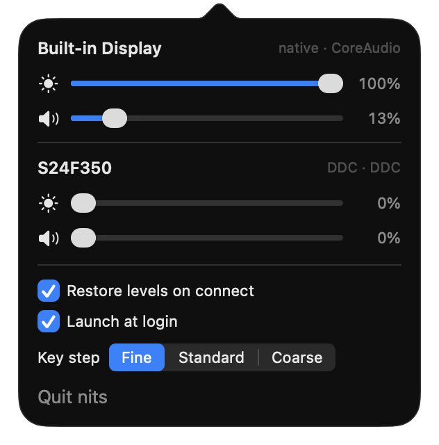

# nits

A focused macOS menu-bar app for controlling external monitor brightness, contrast
and volume, and for making the Mac's own brightness/volume controls more precise.

Built because BetterDisplay Pro does far more than needed and MonitorControl has
degraded on recent macOS. *nit* is the unit of luminance.

<p align="center">
  
</p>

## Features

- Menu-bar panel with live sliders for brightness, volume and contrast, per display.
- Brightness and volume keys intercepted, with an on-screen HUD. Brightness goes to the
  display with the focused window; volume goes to whichever display is playing the
  sound.
- Adjustable key step: fine (1/32), standard (1/16, matching macOS) or coarse (1/8),
  with Shift+Option always a quarter of whichever is set.
- Settings remembered per display and restored on reconnect and wake.
- Opt-in launch at login.

Many monitors, including the one this was built on, expose **no settable CoreAudio
volume**, so macOS's own volume keys control nothing when the monitor is the default
output. nits sends volume over DDC VCP `0x62` in that case, which is the gap this app
closes.

## Status

**v0.1, feature-complete for v1, tested on one monitor.** Developed and verified
against a Samsung C34J79x over USB-C on an M1 Pro running macOS 26. Other panels and
cables should work if they speak DDC/CI, but are unverified — `make probe` will tell
you, and reports of what works on your hardware are very welcome (see
[Contributing](#contributing)). `docs/hardware.md` has the measured timings and
findings.

## Installing

Needs an Apple Silicon Mac on macOS 14 or later.

1. Download `nits-X.Y.Z.dmg` from [Releases](https://github.com/atemp21/nits/releases),
   open it and drag **nits** to Applications.
2. Open nits. macOS will refuse the first time, because nits is not notarised (that
   needs a paid Apple developer account). The warning only offers **Done** and
   **Move to Trash**: click **Done**. Then go to **System Settings → Privacy &
   Security**, scroll down to the message about nits and click **Open Anyway**.
   Alternatively, from Terminal: `xattr -dr com.apple.quarantine /Applications/nits.app`.
3. nits appears in the menu bar and asks for **Accessibility** permission, which the
   brightness and volume keys need. The sliders work without it.

To update, quit nits and drag the new version over the old one. Every release is
signed with the same certificate, so the Accessibility grant carries over. If you
would rather not run an unnotarised binary, [install from source](#installing-from-source)
instead; it is the same code, and Gatekeeper does not prompt for apps built on your
own Mac.

## Building from source

### Requirements

- Apple Silicon Mac, macOS 14 or later
- Xcode 26 or later (the app uses the macOS 26 SDK, but still runs on macOS 14)
- [XcodeGen](https://github.com/yonaskolb/XcodeGen) for the app: `brew install xcodegen`

### Installing from source

```sh
git clone https://github.com/atemp21/nits.git
cd nits
make install
```

This builds a Release copy, copies it to `/Applications` and launches it. The first
run also creates the *nits Local Signing* identity described below, and macOS may ask
for your login keychain password. Run `make install` again after pulling to update,
and `make uninstall` to remove nits.

A source install and the DMG are signed with different certificates, so switching
between them means granting Accessibility again.

### Building and running

```sh
make signing-cert   # once per machine, see below
make run            # build and launch the menu-bar app
```

The media-key tap needs **Accessibility** permission, which macOS will not let an app
grant itself. nits prompts on first launch and starts the tap the moment it is
granted, with no relaunch. Everything else works without it.

Accessibility grants are tied to the code signature, and an ad-hoc signature changes
on every build, silently revoking the grant. `make signing-cert` creates a
self-signed code-signing identity named *nits Local Signing* in your login keychain so
the grant survives rebuilds. It is not trusted system-wide and signs nothing but this
app; delete it from Keychain Access whenever you like.

If you build a fork alongside another copy of nits, give it its own bundle id so the
two don't share permission grants: `make run BUNDLE_ID=com.example.nits`.

## A word of caution

nits writes to your monitor's settings over DDC/CI using private macOS APIs. That is
how every tool of this kind works, and it has been gentle on the hardware it was
tested on, but monitors vary and some firmware is fragile. It is provided as-is, with
no warranty; see [LICENSE](LICENSE).

## Why native Swift

External monitor brightness means DDC/CI over I2C, which has no public API on Apple
Silicon. It requires `IOAVServiceCreateWithService` / `IOAVServiceWriteI2C` from
IOKit, callable only in-process. Electron or Python would need a Swift helper doing
all the real work anyway, plus a runtime tax on what is a menu-bar slider. Global
media-key interception (`CGEventTap`) is likewise native-only.

## Layout

```
Sources/NitsCore/          logic, no UI, testable without hardware
  PrivateAPI.swift         the ONLY file touching undeclared symbols
  DDC.swift                VCP framing + I2C transactions
  DisplayRegistry.swift    CGDisplay <-> IORegistry AV service matching
  Audio.swift              CoreAudio volume
  Coalescer.swift          latest-wins writes in front of slow hardware
  DisplayController.swift  per-display state, picks its backends by capability
  DisplayManager.swift     owns controllers, rebuilds on reconnect
Sources/nitsprobe/         diagnostics CLI
App/                       menu-bar app (AppKit shell, SwiftUI panel)
project.yml                Xcode project spec; the .xcodeproj is generated
```

`PrivateAPI.swift` resolves every undeclared symbol with `dlsym` at runtime rather
than binding at link time, so a symbol disappearing in a future macOS degrades one
feature instead of preventing launch. That single choke point is the direct answer to
why comparable tools break across OS upgrades.

## Development

```sh
make test    # unit tests, no hardware needed
make probe   # hardware diagnostics, read-only
make run     # build and launch the menu-bar app
make stop    # quit it
make shots   # render the panel and HUD to PNGs for design review
```

The `.xcodeproj` is generated from `project.yml` rather than checked in, so build
settings stay diffable.

### Releasing

```sh
make release-cert        # once, ever; then add the two secrets it prints
git tag v0.2.0 && git push origin v0.2.0
```

The tag triggers `.github/workflows/release.yml`, which builds a Release app, signs it
with the release certificate and publishes `nits-0.2.0.dmg` as a GitHub release.
`make dmg` does the same locally. Keep the `.p12` and its password backed up: users'
Accessibility grants are tied to that certificate, so replacing it makes everyone
re-grant once.

Run `make probe` with the monitor attached to find out whether DDC works on your
cable, and whether the monitor's speakers expose a settable CoreAudio volume.

## Roadmap

- [x] **M0** core modules, probe CLI, unit tests
- [x] **M1** DDC confirmed against the panel — the approach works
- [x] **M2** volume: DDC `0x62` for this panel, CoreAudio where available
- [x] **M3** menu-bar UI with live sliders
- [x] **M4** event tap, custom HUD, key routing, fine steps *(needs Accessibility)*
- [x] **M5** persistence, reconnect and wake handling, launch at login
- [x] **M6** contrast slider (VCP `0x12`), shown only where the panel answers the read
- [x] **M7** configurable key step size
- [x] **v0.1.0** signed DMG releases, built by CI on a tag

Deliberately out of scope for v1: sub-hardware-minimum software dimming,
input-source switching (VCP `0x60`), named presets. Seams are left for each.

Open items are in [TODO.md](TODO.md).

## Contributing

Bug reports and hardware reports are the most useful thing right now. Please include
the output of `make probe`, your monitor model, and how it is connected (USB-C,
DisplayPort, HDMI, dock). For code changes, read [CONTRIBUTING.md](CONTRIBUTING.md)
first; the hard rules in [AGENTS.md](AGENTS.md) apply to everyone.

## Licence

[MIT](LICENSE).
